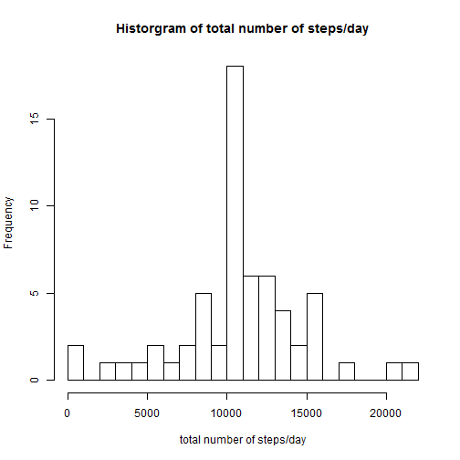

Statistics on Activity Data (PA1)
==================================

Load the required packages to R.

```r
library(plyr)
library(dplyr)
library(lattice)
```


The raw data is stored in the activity.csv file.

```r
activity<-read.csv("activity.csv")
```

**What is mean total number of steps taken per day?**  
Calculation of the total number of steps taken per day.

```r
steps_day<-ddply(activity,.(date), summarize, steps_day=sum(steps))
```

A histogram of the total number of steps taken each day.

```r
hist(steps_day$steps, 
        breaks=25, 
        xlab="total number of steps/day", 
        main="Historgram of total number of steps/day")
```

 

The mean and median of the total number of steps taken per day.

```r
mean<-mean(steps_day$steps, na.rm=TRUE)
median<-median(steps_day$steps, na.rm=TRUE)
```
The average number of steps/day is 10766.19.  
The median number of steps/day is 10765.

**What is the average daily activity pattern?**  
A time series plot.

```r
steps_interval<-aggregate(activity$steps, by=list(interval=activity$interval), FUN=mean, na.rm=TRUE)
with(steps_interval, plot(interval, x, 
                          type="l", 
                          xlab="interval", 
                          ylab="average number of steps", 
                          main="The average number of steps per intervals."))
```

 

Which 5-minute interval, on average across all the days in the dataset, contains the maximum number of steps?

```r
max_interval<-steps_interval[which.max(steps_interval$steps), ]
```
The highest average number of steps was 206 in the 835^th^ interval.  

**Imputing missing values**
The total number of missing values in the dataset.

```r
no_NAs<-sum(is.na(activity$steps))
```
In the activity dataset there are 2304 missing values.  

Replacement of NA-s with the total mean in a new dataset.

```r
#calculate mean
totalmean<-mean(activity$steps, na.rm=TRUE)
#create a new data frame
activity2<-activity
#repalce NAs
activity2[is.na(activity2)]<-totalmean
#check for NAs
no_NAs2<-sum(is.na(activity2$steps))
```
In the modified dataset (activity2) there are 0 missing values.

Calculation of the total number of steps taken per day.

```r
steps_day2<-aggregate(steps ~ date, activity2, sum)
```

A histogram of the total number of steps taken each day.

```r
hist(steps_day2$steps, 
     breaks=25, 
     xlab="total number of steps/day", 
     main="Historgram of total number of steps/day")
```

 

The mean and median of the total number of steps taken per day.

```r
mean2<-mean(steps_day2$steps)
median2<-median(steps_day2$steps)
```
The average number of steps/day is 10766.19.  
The median number of steps/day is 10766.19.

Do these values differ from the estimates from the first part of the assignment?

**Befor NA replacement:**
 Mean: 10766.19;
 Median: 10765

**After NA repalcement:**
 Mean: 10766.19; 
 Median: 10766.19

With the repalcement of NAs the value of mean was not changed, the mean was slightly altered.

**Are there differences in activity patterns between weekdays and weekends?**  
Splitting the data to weekdays and weekends.

```r
#transform the date variable to date
activity2$date <- as.Date(activity2$date, format = "%Y-%m-%d")
#create a new variable with the names of days
activity2_day<-mutate(activity2, day=weekdays(date))
#create a new factor variable with the types of the days
activity2_daytype<-mutate(activity2_day, daytype=factor(day==c("Saturday", "Sunday"), labels=c("weekday", "weekend")))
```

A time series plots by daytype.

```r
steps_daytype<-aggregate(steps~interval+daytype, data=activity2_daytype, FUN="mean")
xyplot(steps~interval|daytype, data=steps_daytype,
                          layout=c(1,2), 
                          type="l")
```

 

There is an obvious difference in the activity on weekdays and weekends. While on weekdays there is a high activity in the 2^nd^ quarter of the day then the rest is more or less steady, on weekends the activity is much more fluctuating.
